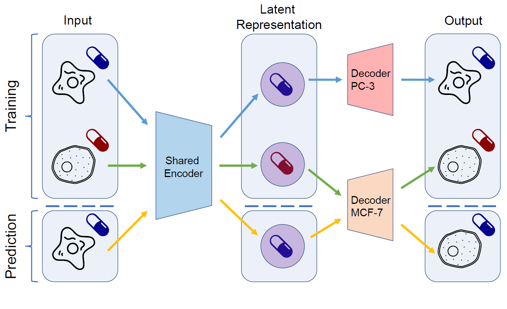

## DeepCellState: drug response prediction

Drug treatment induces cell type specific transcriptional programs, and as the number of combinations of drugs and cell types grows, the cost for exhaustive screens measuring the transcriptional drug response becomes intractable. We developed DeepCellState, a neural network auto-encoder framework based on the DeepFake approach, for prediction of the induced transcriptional state in a cell type after drug treatment, based on the drug response in another cell type.

DeepCellState requires ```tensorflow>=2.3.0```, which can be installed via pip:
```sh
pip install tensorflow
```

To run DeepCellState, download the [data](https://www.dropbox.com/s/dluxw8zryh1hoyf/DeepCellState_data.zip?dl=1) and extract it to some location. Add this path (**parent folder of the data folder**) to to the data_dir file in the project root. 
Run DeepCellState.py to generate the models:
```sh
python3 DeepCellState.py -O models_output -CT A375,HT29 -PT trt_cp -N 1 -SM 0
```
Parameters:
- ```-O```: Output directory.
- ```-CT```: Comma separated list of cell types to use in addition to MCF7 and PC3.
- ```-PT```: Perturbation type to be used, defaults to trt_cp. 
- ```-N```: Number of models trained for each fold. The model with best validation performance is picked.
- ```-SM```: Set to 1 to train drug MoA family models or set to 2 to train external validation model. Defaults to 0, i.e. 10-fold cross-validation.

Trained models can be downloaded from:
[models](https://www.dropbox.com/s/7c77tzxaefhom2d/DeepCellState_models.zip?dl=1)

Extract them into the same directory as the data folder. 

This is how DeepCellState models can be used in a custom script to make predictions:

```python
import pickle
from tensorflow import keras

model = "best_autoencoder_ext_val/"
autoencoder = keras.models.load_model(model + "main_model/")
cell_decoders = {"MCF7": pickle.load(open(model + "MCF7" + "_decoder_weights", "rb")),
                 "PC3": pickle.load(open(model + "PC3" + "_decoder_weights", "rb"))}
autoencoder.get_layer("decoder").set_weights(cell_decoders["MCF7"])
pc3_response = ... # get an array of dimension 1, 978, 1
# convert PC3 response to MCF7 response
mcf7_predicted_response = autoencoder.predict(pc3_response) 
```

